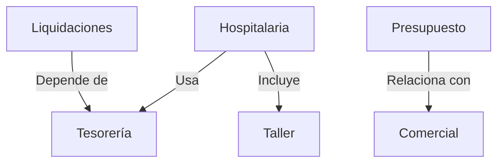

# Estructura de Menús - Mantenedores

## Jerarquía Visual Completa

```
Mantenedores (maintenance)
│
├── 📋 Básica (position: 1)
├── 💼 Comercial (position: 2)
├── 🏢 Estructura (position: 3)
├── 💰 Tesorería (position: 5)
│
├── 🏥 Hospitalaria (position: 6) ← NUEVO
│   ├── Categorías de Atención
│   ├── Destinos de Cierre de Atención
│   ├── Intervenciones de Atención
│   ├── Categorías de Acciones Clínicas
│   ├── Preguntas de Acciones Clínicas
│   ├── Respuestas de Acciones Clínicas
│   ├── Tipos de Dosificación
│   ├── Historial de Trastornos Alimentarios
│   ├── Estados de Intoxicación
│   ├── Dispositivos Médicos
│   ├── Diagnósticos Nutricionales
│   ├── Índices IMC Nutricionista
│   ├── Clasificación Índices Nutricionista
│   ├── Índices TE Nutricionista
│   ├── Agrupaciones de Examen Físico
│   ├── Campos de Examen Físico
│   ├── Campos Base de Examen Físico
│   ├── Tipos de Prescripción
│   ├── Dispensaciones de Prescripción
│   ├── Dosificaciones de Prescripción
│   ├── Formatos de Prescripción
│   ├── Frecuencias de Prescripción
│   ├── Vías de Prescripción
│   └── Detalles de Reglas de Prescripción
│
├── 💵 Liquidaciones (position: 7) ← NUEVO
│   ├── Cuentas Bancarias
│   ├── Asociación Usuario-Empresa
│   ├── UF Diaria
│   ├── Participación Profesional
│   └── Base de Liquidaciones
│
├── 📊 Presupuesto (position: 8) ← NUEVO
│   ├── Pie de Presupuesto
│   ├── Pie de Presupuesto por Financiador
│   └── Pie del Financiador
│
├── 🎓 Taller (position: 9) ← NUEVO
│   └── Talleres
│
├── 📦 Logística (position: 10)
└── 🏥 Pabellón (position: 11)
```

## Detalles por Categoría

### 1. Hospitalaria (24 mantenedores)

#### Atención y Cuidado (3)
| Entidad | Label | Ruta |
|---------|-------|------|
| `care_category` | Categorías de Atención | `app_maintainers_hospital_care_category_index` |
| `care_closure_destination` | Destinos de Cierre de Atención | `app_maintainers_hospital_care_closure_destination_index` |
| `care_intervention` | Intervenciones de Atención | `app_maintainers_hospital_care_intervention_index` |

#### Acciones Clínicas (3)
| Entidad | Label | Ruta |
|---------|-------|------|
| `clinical_action_category` | Categorías de Acciones Clínicas | `app_maintainers_hospital_clinical_action_category_index` |
| `clinical_action_question` | Preguntas de Acciones Clínicas | `app_maintainers_hospital_clinical_action_question_index` |
| `clinical_action_answer` | Respuestas de Acciones Clínicas | `app_maintainers_hospital_clinical_action_answer_index` |

#### Tipos Generales (4)
| Entidad | Label | Ruta |
|---------|-------|------|
| `dosage_type` | Tipos de Dosificación | `app_maintainers_hospital_dosage_type_index` |
| `eating_disorder_history` | Historial de Trastornos Alimentarios | `app_maintainers_hospital_eating_disorder_history_index` |
| `intoxication_state` | Estados de Intoxicación | `app_maintainers_hospital_intoxication_state_index` |
| `medical_device` | Dispositivos Médicos | `app_maintainers_hospital_medical_device_index` |

#### Nutrición (4)
| Entidad | Label | Ruta |
|---------|-------|------|
| `nutritional_diagnosis` | Diagnósticos Nutricionales | `app_maintainers_hospital_nutritional_diagnosis_index` |
| `nutritionist_bmi_index` | Índices IMC Nutricionista | `app_maintainers_hospital_nutritionist_bmi_index_index` |
| `nutritionist_index_classification` | Clasificación Índices Nutricionista | `app_maintainers_hospital_nutritionist_index_classification_index` |
| `nutritionist_te_index` | Índices TE Nutricionista | `app_maintainers_hospital_nutritionist_te_index_index` |

#### Examen Físico (3)
| Entidad | Label | Ruta |
|---------|-------|------|
| `physical_exam_grouping` | Agrupaciones de Examen Físico | `app_maintainers_hospital_physical_exam_grouping_index` |
| `physical_exam_field` | Campos de Examen Físico | `app_maintainers_hospital_physical_exam_field_index` |
| `physical_exam_base_field` | Campos Base de Examen Físico | `app_maintainers_hospital_physical_exam_base_field_index` |

#### Prescripciones (7)
| Entidad | Label | Ruta |
|---------|-------|------|
| `prescription_type` | Tipos de Prescripción | `app_maintainers_hospital_prescription_type_index` |
| `prescription_dispensation` | Dispensaciones de Prescripción | `app_maintainers_hospital_prescription_dispensation_index` |
| `prescription_dosage` | Dosificaciones de Prescripción | `app_maintainers_hospital_prescription_dosage_index` |
| `prescription_format` | Formatos de Prescripción | `app_maintainers_hospital_prescription_format_index` |
| `prescription_frequency` | Frecuencias de Prescripción | `app_maintainers_hospital_prescription_frequency_index` |
| `prescription_route` | Vías de Prescripción | `app_maintainers_hospital_prescription_route_index` |
| `prescription_rule_detail` | Detalles de Reglas de Prescripción | `app_maintainers_hospital_prescription_rule_detail_index` |

---

### 2. Liquidaciones (5 mantenedores)

| Entidad | Label | Ruta | Ícono |
|---------|-------|------|-------|
| `bank_account` | Cuentas Bancarias | `app_maintainers_settlements_bank_account_index` | `bx bx-wallet` |
| `company_user_association` | Asociación Usuario-Empresa | `app_maintainers_settlements_company_user_association_index` | `bx bx-link` |
| `daily_uf` | UF Diaria | `app_maintainers_settlements_daily_uf_index` | `bx bx-calendar-event` |
| `professional_participation` | Participación Profesional | `app_maintainers_settlements_professional_participation_index` | `bx bx-user-check` |
| `settlement_base` | Base de Liquidaciones | `app_maintainers_settlements_settlement_base_index` | `bx bx-calculator` |

---

### 3. Presupuesto (3 mantenedores)

| Entidad | Label | Ruta | Ícono |
|---------|-------|------|-------|
| `budget_footer` | Pie de Presupuesto | `app_maintainers_budget_budget_footer_index` | `bx bx-note` |
| `budget_footer_by_funder` | Pie de Presupuesto por Financiador | `app_maintainers_budget_budget_footer_by_funder_index` | `bx bx-user-pin` |
| `budget_funder_footer` | Pie del Financiador | `app_maintainers_budget_budget_funder_footer_index` | `bx bx-file-blank` |

---

### 4. Taller (1 mantenedor)

| Entidad | Label | Ruta | Ícono |
|---------|-------|------|-------|
| `workshop` | Talleres | `app_maintainers_workshop_workshop_index` | `bx bx-group` |

---

## Iconografía Utilizada

### Por Categoría
| Categoría | Ícono Principal | Boxicon |
|-----------|----------------|---------|
| Hospitalaria | 🏥 | `bx bx-plus-medical` |
| Liquidaciones | 💵 | `bx bx-calculator` |
| Presupuesto | 📊 | `bx bx-receipt` |
| Taller | 🎓 | `bx bx-chalkboard` |

### Por Funcionalidad
| Funcionalidad | Íconos Usados |
|---------------|---------------|
| Categorías/Clasificación | `bx-category-alt`, `bx-category`, `bx-list-ul` |
| Atención Médica | `bx-first-aid`, `bx-plus-medical`, `bx-body` |
| Documentos | `bx-file-blank`, `bx-note`, `bx-receipt` |
| Dispositivos | `bx-devices`, `bx-injection` |
| Evaluación | `bx-help-circle`, `bx-message-square-check` |
| Financiero | `bx-calculator`, `bx-wallet`, `bx-dollar-circle` |
| Usuarios | `bx-user-check`, `bx-user-pin`, `bx-link` |
| Nutrición | `bx-restaurant`, `bx-food-menu`, `bx-bar-chart-alt-2` |
| Tiempo | `bx-time`, `bx-calendar-event` |
| Movimiento | `bx-exit`, `bx-right-arrow-alt`, `bx-transfer` |
| Grupos | `bx-group`, `bx-chalkboard` |

## Nomenclatura de Base de Datos

### Convención de Nombres de Menú

```
Patrón: maintainers.{category}[.{entity}]

Padre:  maintainers.{category}
Hijo:   maintainers.{category}.{entity}
```

**Ejemplos:**
```
maintainers.hospital                              # Padre
maintainers.hospital.care_category                # Hijo
maintainers.settlements                           # Padre
maintainers.settlements.bank_account              # Hijo
```

### Convención de Rutas

```
Patrón: app_maintainers_{category}_{entity}_index
```

**Ejemplos:**
```
app_maintainers_hospital_care_category_index
app_maintainers_settlements_bank_account_index
app_maintainers_budget_budget_footer_index
app_maintainers_workshop_workshop_index
```

## Estructura de Controladores

```
src/Controller/Maintainers/
├── Hospital/
│   ├── CareCategoryController.php
│   ├── CareClosureDestinationController.php
│   ├── CareInterventionController.php
│   └── ... (21 más)
│
├── Settlements/
│   ├── BankAccountController.php
│   ├── CompanyUserAssociationController.php
│   ├── DailyUfController.php
│   ├── ProfessionalParticipationController.php
│   └── SettlementBaseController.php
│
├── Budget/
│   ├── BudgetFooterController.php
│   ├── BudgetFooterByFunderController.php
│   └── BudgetFunderFooterController.php
│
└── Workshop/
    └── WorkshopController.php
```

## Estructura de Templates

```
templates/maintainers/
├── hospital/
│   ├── care_category/
│   ├── care_closure_destination/
│   └── ... (22 más)
│
├── settlements/
│   ├── bank_account/
│   ├── company_user_association/
│   ├── daily_uf/
│   ├── professional_participation/
│   └── settlement_base/
│
├── budget/
│   ├── budget_footer/
│   ├── budget_footer_by_funder/
│   └── budget_funder_footer/
│
└── workshop/
    └── workshop/
```

## Orden de Posiciones en Menú

| Posición | Categoría | Estado |
|----------|-----------|--------|
| 1 | Básica | Migrada |
| 2 | Comercial | Migrada |
| 3 | Estructura | Migrada |
| 4 | (Reservada) | - |
| 5 | Tesorería | Migrada |
| **6** | **Hospitalaria** | **Nueva** |
| **7** | **Liquidaciones** | **Nueva** |
| **8** | **Presupuesto** | **Nueva** |
| **9** | **Taller** | **Nueva** |
| 10 | Logística | Migrada |
| 11 | Pabellón | Migrada |

## Permisos y Roles

Todos los mantenedores requieren:
- `requires_auth: true`
- `required_roles: ["ROLE_USER"]`

Para configurar permisos más restrictivos, modificar el campo `required_roles` en los scripts SQL.

### Ejemplos de Roles Personalizados

```sql
-- Solo administradores
required_roles = '["ROLE_ADMIN"]'

-- Usuarios y supervisores
required_roles = '["ROLE_USER", "ROLE_SUPERVISOR"]'

-- Solo personal médico
required_roles = '["ROLE_MEDICAL"]'
```

## Relaciones entre Categorías



### Dependencias Funcionales

- **Liquidaciones** usa tipos de cuenta bancaria de **Tesorería**
- **Presupuesto** se vincula con financiadores de **Comercial**
- **Hospitalaria** puede usar datos de **Taller** para actividades grupales
- **Liquidaciones** necesita datos de **UF Diaria** para cálculos

## Checklist de Verificación Post-Instalación

### Base de Datos
- [ ] Menú padre existe (maintenance)
- [ ] 4 categorías insertadas
- [ ] 33 mantenedores totales insertados
- [ ] Posiciones correctas (6, 7, 8, 9)

### Aplicación
- [ ] Caché limpiada
- [ ] Rutas verificadas con `debug:router`
- [ ] Controladores implementados
- [ ] Templates creados

### Interfaz Web
- [ ] Menús aparecen en sidebar
- [ ] Enlaces funcionan correctamente
- [ ] Permisos se respetan
- [ ] Íconos se muestran correctamente

### Testing
- [ ] Listar registros (index)
- [ ] Crear nuevo registro
- [ ] Editar registro existente
- [ ] Eliminar registro
- [ ] Exportar a Excel

---

**Última actualización:** 2026-02-04
**Total de mantenedores:** 33
**Categorías nuevas:** 4
