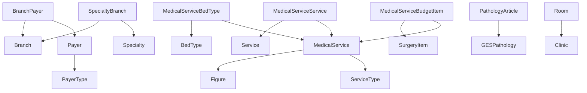

# SPEC: Mantenedores Comerciales

**Categoría**: Commercial  
**Total Mantenedores**: 22  
**Estado**: ✅ Implementado  
**Última actualización**: 2026-02-09

---

## 📐 Arquitectura

Todos los mantenedores comerciales extienden `AbstractMantenedorController` que implementa:
- ✅ CRUD completo con Template Method Pattern
- ✅ Paginación automática vía QueryBuilder
- ✅ Turbo Frames para modales
- ✅ Multi-tenancy con TenantEntityManager
- ✅ Exportación CSV

**Ruta base**: `/maintainers/commercial/{mantenedor}`

---

## 🗂️ Mantenedores Implementados

### 1. Treatment Type (Tipo de Tratamiento)

**Controlador**: `App\Controller\Maintainers\Commercial\TreatmentTypeController`  
**Entidad**: `App\Entity\Tenant\TreatmentType`  
**Form**: `App\Form\Maintainers\Commercial\TreatmentTypeType`  
**Template**: `templates/maintainers/commercial/treatment_type/index.html.twig`

**Endpoints**:
- `GET /maintainers/commercial/treatment-type` → `app_maintainers_commercial_treatment_type_index`
- `GET /maintainers/commercial/treatment-type/create` → `app_maintainers_commercial_treatment_type_create`
- `GET /maintainers/commercial/treatment-type/{id}/edit` → `app_maintainers_commercial_treatment_type_edit`
- `DELETE /maintainers/commercial/treatment-type/{id}` → `app_maintainers_commercial_treatment_type_delete`
- `GET /maintainers/commercial/treatment-type/export` → `app_maintainers_commercial_treatment_type_export`

**Columnas**: id, name, code, description, isActive  
**Paginación**: ✅ QueryBuilder (DESC por ID)  
**Features**: CRUD + Export

---

### 2. Payer Type (Tipo de Pagador)

**Controlador**: `App\Controller\Maintainers\Commercial\PayerTypeController`  
**Entidad**: `App\Entity\Tenant\PayerType`  
**Form**: `App\Form\Maintainers\Commercial\PayerTypeType`  
**Template**: `templates/maintainers/commercial/payer_type/index.html.twig`

**Endpoints**:
- `GET /maintainers/commercial/payer-type` → `app_maintainers_commercial_payer_type_index`
- `GET /maintainers/commercial/payer-type/create` → `app_maintainers_commercial_payer_type_create`
- `GET /maintainers/commercial/payer-type/{id}/edit` → `app_maintainers_commercial_payer_type_edit`
- `DELETE /maintainers/commercial/payer-type/{id}` → `app_maintainers_commercial_payer_type_delete`
- `GET /maintainers/commercial/payer-type/export` → `app_maintainers_commercial_payer_type_export`

**Columnas**: id, name, code, description, isActive  
**Paginación**: ✅ QueryBuilder (DESC por ID)  
**Features**: CRUD + Export

---

### 3. ENO Pathology (Patología ENO)

**Controlador**: `App\Controller\Maintainers\Commercial\ENOPathologyController`  
**Entidad**: `App\Entity\Tenant\ENOPathology`  
**Form**: `App\Form\Maintainers\Commercial\ENOPathologyType`  
**Template**: `templates/maintainers/commercial/eno_pathology/index.html.twig`

**Endpoints**:
- `GET /maintainers/commercial/eno-pathology` → `app_maintainers_commercial_eno_pathology_index`
- `GET /maintainers/commercial/eno-pathology/create` → `app_maintainers_commercial_eno_pathology_create`
- `GET /maintainers/commercial/eno-pathology/{id}/edit` → `app_maintainers_commercial_eno_pathology_edit`
- `DELETE /maintainers/commercial/eno-pathology/{id}` → `app_maintainers_commercial_eno_pathology_delete`
- `GET /maintainers/commercial/eno-pathology/export` → `app_maintainers_commercial_eno_pathology_export`

**Columnas**: id, code, name, icd10Code, requiresSpecialist, isChronic, isActive  
**Paginación**: ✅ QueryBuilder (DESC por ID)  
**Features**: CRUD + Export  
**Nota**: ENO = Enfermedades No Oncológicas

---

### 4. Medical Service (Servicio Médico)

**Controlador**: `App\Controller\Maintainers\Commercial\MedicalServiceController`  
**Entidad**: `App\Entity\Tenant\MedicalService`  
**Form**: `App\Form\Maintainers\Commercial\MedicalServiceType`  
**Template**: `templates/maintainers/commercial/medical_service/index.html.twig`

**Endpoints**:
- `GET /maintainers/commercial/medical-service` → `app_maintainers_commercial_medical_service_index`
- `GET /maintainers/commercial/medical-service/create` → `app_maintainers_commercial_medical_service_create`
- `GET /maintainers/commercial/medical-service/{id}/edit` → `app_maintainers_commercial_medical_service_edit`
- `DELETE /maintainers/commercial/medical-service/{id}` → `app_maintainers_commercial_medical_service_delete`
- `GET /maintainers/commercial/medical-service/export` → `app_maintainers_commercial_medical_service_export`

**Columnas**: id, code, name, fonasaCode, imedCode, serviceType.name, isProcedure, isActive  
**Paginación**: ✅ QueryBuilder (ASC por code)  
**Features**: CRUD + Export  
**Relaciones**: JOIN con figure, serviceType

---

### 5. Consultation Type (Tipo de Consulta)

**Controlador**: `App\Controller\Maintainers\Commercial\ConsultationTypeController`  
**Entidad**: `App\Entity\Tenant\ConsultationType`  
**Form**: `App\Form\Maintainers\Commercial\ConsultationTypeType`  
**Template**: `templates/maintainers/commercial/consultation_type/index.html.twig`

**Endpoints**:
- `GET /maintainers/commercial/consultation-type` → `app_maintainers_commercial_consultation_type_index`
- `GET /maintainers/commercial/consultation-type/create` → `app_maintainers_commercial_consultation_type_create`
- `GET /maintainers/commercial/consultation-type/{id}/edit` → `app_maintainers_commercial_consultation_type_edit`
- `DELETE /maintainers/commercial/consultation-type/{id}` → `app_maintainers_commercial_consultation_type_delete`
- `GET /maintainers/commercial/consultation-type/export` → `app_maintainers_commercial_consultation_type_export`

**Columnas**: id, name, code, description, isActive  
**Paginación**: ✅ QueryBuilder (DESC por ID)  
**Features**: CRUD + Export

---

### 6. GES Pathology (Patología GES)

**Controlador**: `App\Controller\Maintainers\Commercial\GESPathologyController`  
**Entidad**: `App\Entity\Tenant\GESPathology`  
**Form**: `App\Form\Maintainers\Commercial\GESPathologyType`  
**Template**: `templates/maintainers/commercial/ges_pathology/index.html.twig`

**Endpoints**:
- `GET /maintainers/commercial/ges-pathology` → `app_maintainers_commercial_ges_pathology_index`
- `GET /maintainers/commercial/ges-pathology/create` → `app_maintainers_commercial_ges_pathology_create`
- `GET /maintainers/commercial/ges-pathology/{id}/edit` → `app_maintainers_commercial_ges_pathology_edit`
- `DELETE /maintainers/commercial/ges-pathology/{id}` → `app_maintainers_commercial_ges_pathology_delete`
- `GET /maintainers/commercial/ges-pathology/export` → `app_maintainers_commercial_ges_pathology_export`

**Columnas**: id, pathologyNumber, name, minAge, maxAge, genderRestriction, guaranteedDays, isActive  
**Paginación**: ✅ QueryBuilder (ASC por pathologyNumber)  
**Features**: CRUD + Export  
**Nota**: GES = Garantías Explícitas en Salud

---

### 7. Payer (Pagador)

**Controlador**: `App\Controller\Maintainers\Commercial\PayerController`  
**Entidad**: `App\Entity\Tenant\Payer`  
**Form**: `App\Form\Maintainers\Commercial\PayerType`  
**Template**: `templates/maintainers/commercial/payer/index.html.twig`

**Endpoints**:
- `GET /maintainers/commercial/payer` → `app_maintainers_commercial_payer_index`
- `GET /maintainers/commercial/payer/create` → `app_maintainers_commercial_payer_create`
- `GET /maintainers/commercial/payer/{id}/edit` → `app_maintainers_commercial_payer_edit`
- `DELETE /maintainers/commercial/payer/{id}` → `app_maintainers_commercial_payer_delete`
- `GET /maintainers/commercial/payer/export` → `app_maintainers_commercial_payer_export`

**Columnas**: id, code, name, payerType.name, rut, phone, requiresAuthorization, isActive  
**Paginación**: ✅ QueryBuilder (DESC por ID)  
**Features**: CRUD + Export  
**Relaciones**: JOIN con payerType

---

### 8. Specialty (Especialidad)

**Controlador**: `App\Controller\Maintainers\Commercial\SpecialtyController`  
**Entidad**: `App\Entity\Tenant\Specialty`  
**Form**: `App\Form\Maintainers\Commercial\SpecialtyType`  
**Template**: `templates/maintainers/commercial/specialty/index.html.twig`

**Endpoints**:
- `GET /maintainers/commercial/specialty` → `app_maintainers_commercial_specialty_index`
- `GET /maintainers/commercial/specialty/create` → `app_maintainers_commercial_specialty_create`
- `GET /maintainers/commercial/specialty/{id}/edit` → `app_maintainers_commercial_specialty_edit`
- `DELETE /maintainers/commercial/specialty/{id}` → `app_maintainers_commercial_specialty_delete`
- `GET /maintainers/commercial/specialty/export` → `app_maintainers_commercial_specialty_export`

**Columnas**: id, code, name, category, defaultConsultationDuration, requiresCertification, isActive  
**Paginación**: ✅ QueryBuilder (DESC por ID)  
**Features**: CRUD + Export

---

### 9. Cancellation Type (Tipo de Cancelación)

**Controlador**: `App\Controller\Maintainers\Commercial\CancellationTypeController`  
**Entidad**: `App\Entity\Tenant\CancellationType`  
**Form**: `App\Form\Maintainers\Commercial\CancellationTypeType`  
**Template**: `templates/maintainers/commercial/cancellation_type/index.html.twig`

**Endpoints**:
- `GET /maintainers/commercial/cancellation-type` → `app_maintainers_commercial_cancellation_type_index`
- `GET /maintainers/commercial/cancellation-type/create` → `app_maintainers_commercial_cancellation_type_create`
- `GET /maintainers/commercial/cancellation-type/{id}/edit` → `app_maintainers_commercial_cancellation_type_edit`
- `DELETE /maintainers/commercial/cancellation-type/{id}` → `app_maintainers_commercial_cancellation_type_delete`
- `GET /maintainers/commercial/cancellation-type/export` → `app_maintainers_commercial_cancellation_type_export`

**Columnas**: id, name, code, description, isActive  
**Paginación**: ✅ QueryBuilder (DESC por ID)  
**Features**: CRUD + Export

---

### 10. Medical Service Budget Item (Artículo de Presupuesto de Servicio Médico)

**Controlador**: `App\Controller\Maintainers\Commercial\MedicalServiceBudgetItemController`  
**Entidad**: `App\Entity\Tenant\MedicalServiceBudgetItem`  
**Form**: `App\Form\Maintainers\Commercial\MedicalServiceBudgetItemType`  
**Template**: `templates/maintainers/commercial/medical_service_budget_item/index.html.twig`

**Endpoints**:
- `GET /maintainers/commercial/medical-service-budget-item` → `app_maintainers_commercial_medical_service_budget_item_index`
- `GET /maintainers/commercial/medical-service-budget-item/create` → `app_maintainers_commercial_medical_service_budget_item_create`
- `GET /maintainers/commercial/medical-service-budget-item/{id}/edit` → `app_maintainers_commercial_medical_service_budget_item_edit`
- `DELETE /maintainers/commercial/medical-service-budget-item/{id}` → `app_maintainers_commercial_medical_service_budget_item_delete`
- `GET /maintainers/commercial/medical-service-budget-item/export` → `app_maintainers_commercial_medical_service_budget_item_export`

**Columnas**: id, medicalService.name, surgeryItem.name, isActive  
**Paginación**: ✅ QueryBuilder (DESC por ID)  
**Features**: CRUD + Export  
**Relaciones**: JOIN con medicalService, surgeryItem

---

### 11. External Referrer (Referente Externo)

**Controlador**: `App\Controller\Maintainers\Commercial\ExternalReferrerController`  
**Entidad**: `App\Entity\Tenant\ExternalReferrer`  
**Form**: `App\Form\Maintainers\Commercial\ExternalReferrerType`  
**Template**: `templates/maintainers/commercial/external_referrer/index.html.twig`

**Endpoints**:
- `GET /maintainers/commercial/external-referrer` → `app_maintainers_commercial_external_referrer_index`
- `GET /maintainers/commercial/external-referrer/create` → `app_maintainers_commercial_external_referrer_create`
- `GET /maintainers/commercial/external-referrer/{id}/edit` → `app_maintainers_commercial_external_referrer_edit`
- `DELETE /maintainers/commercial/external-referrer/{id}` → `app_maintainers_commercial_external_referrer_delete`
- `GET /maintainers/commercial/external-referrer/export` → `app_maintainers_commercial_external_referrer_export`

**Columnas**: id, code, name, referrerType, phone, hasAgreement, isActive  
**Paginación**: ✅ QueryBuilder (DESC por ID)  
**Features**: CRUD + Export

---

### 12. Specialty Branch (Especialidad por Sucursal)

**Controlador**: `App\Controller\Maintainers\Commercial\SpecialtyBranchController`  
**Entidad**: `App\Entity\Tenant\SpecialtyBranch`  
**Form**: `App\Form\Maintainers\Commercial\SpecialtyBranchType`  
**Template**: `templates/maintainers/commercial/specialty_branch/index.html.twig`

**Endpoints**:
- `GET /maintainers/commercial/specialty-branch` → `app_maintainers_commercial_specialty_branch_index`
- `GET /maintainers/commercial/specialty-branch/create` → `app_maintainers_commercial_specialty_branch_create`
- `GET /maintainers/commercial/specialty-branch/{id}/edit` → `app_maintainers_commercial_specialty_branch_edit`
- `DELETE /maintainers/commercial/specialty-branch/{id}` → `app_maintainers_commercial_specialty_branch_delete`
- `GET /maintainers/commercial/specialty-branch/export` → `app_maintainers_commercial_specialty_branch_export`

**Columnas**: id, specialty.name, branch.name, isActive  
**Paginación**: ✅ QueryBuilder (DESC por ID)  
**Features**: CRUD + Export  
**Relaciones**: JOIN con specialty, branch

---

### 13. Room (Habitación)

**Controlador**: `App\Controller\Maintainers\Commercial\RoomController`  
**Entidad**: `App\Entity\Tenant\Room`  
**Form**: `App\Form\Maintainers\Commercial\RoomType`  
**Template**: `templates/maintainers/commercial/room/index.html.twig`

**Endpoints**:
- `GET /maintainers/commercial/room` → `app_maintainers_commercial_room_index`
- `GET /maintainers/commercial/room/create` → `app_maintainers_commercial_room_create`
- `GET /maintainers/commercial/room/{id}/edit` → `app_maintainers_commercial_room_edit`
- `DELETE /maintainers/commercial/room/{id}` → `app_maintainers_commercial_room_delete`
- `GET /maintainers/commercial/room/export` → `app_maintainers_commercial_room_export`

**Columnas**: id, roomNumber, name, roomType, floor, capacity, status, isActive  
**Paginación**: ✅ QueryBuilder (DESC por ID)  
**Features**: CRUD + Export  
**Relaciones**: JOIN con clinic

---

### 14. Branch Payer (Pagador por Sucursal)

**Controlador**: `App\Controller\Maintainers\Commercial\BranchPayerController`  
**Entidad**: `App\Entity\Tenant\BranchPayer`  
**Form**: `App\Form\Maintainers\Commercial\BranchPayerType`  
**Template**: `templates/maintainers/commercial/branch_payer/index.html.twig`

**Endpoints**:
- `GET /maintainers/commercial/branch-payer` → `app_maintainers_commercial_branch_payer_index`
- `GET /maintainers/commercial/branch-payer/create` → `app_maintainers_commercial_branch_payer_create`
- `GET /maintainers/commercial/branch-payer/{id}/edit` → `app_maintainers_commercial_branch_payer_edit`
- `DELETE /maintainers/commercial/branch-payer/{id}` → `app_maintainers_commercial_branch_payer_delete`
- `GET /maintainers/commercial/branch-payer/export` → `app_maintainers_commercial_branch_payer_export`

**Columnas**: id, branch.name, payer.name, isActive  
**Paginación**: ✅ QueryBuilder (DESC por ID)  
**Features**: CRUD + Export  
**Relaciones**: JOIN con branch, payer

---

### 15. Bed Type (Tipo de Cama)

**Controlador**: `App\Controller\Maintainers\Commercial\BedTypeController`  
**Entidad**: `App\Entity\Tenant\BedType`  
**Form**: `App\Form\Maintainers\Commercial\BedTypeType`  
**Template**: `templates/maintainers/commercial/bed_type/index.html.twig`

**Endpoints**:
- `GET /maintainers/commercial/bed-type` → `app_maintainers_commercial_bed_type_index`
- `GET /maintainers/commercial/bed-type/create` → `app_maintainers_commercial_bed_type_create`
- `GET /maintainers/commercial/bed-type/{id}/edit` → `app_maintainers_commercial_bed_type_edit`
- `DELETE /maintainers/commercial/bed-type/{id}` → `app_maintainers_commercial_bed_type_delete`
- `GET /maintainers/commercial/bed-type/export` → `app_maintainers_commercial_bed_type_export`

**Columnas**: id, name, code, description, isActive  
**Paginación**: ✅ QueryBuilder (DESC por ID)  
**Features**: CRUD + Export

---

### 16. Requesting Company (Empresa Solicitante)

**Controlador**: `App\Controller\Maintainers\Commercial\RequestingCompanyController`  
**Entidad**: `App\Entity\Tenant\RequestingCompany`  
**Form**: `App\Form\Maintainers\Commercial\RequestingCompanyType`  
**Template**: `templates/maintainers/commercial/requesting_company/index.html.twig`

**Endpoints**:
- `GET /maintainers/commercial/requesting-company` → `app_maintainers_commercial_requesting_company_index`
- `GET /maintainers/commercial/requesting-company/create` → `app_maintainers_commercial_requesting_company_create`
- `GET /maintainers/commercial/requesting-company/{id}/edit` → `app_maintainers_commercial_requesting_company_edit`
- `DELETE /maintainers/commercial/requesting-company/{id}` → `app_maintainers_commercial_requesting_company_delete`
- `GET /maintainers/commercial/requesting-company/export` → `app_maintainers_commercial_requesting_company_export`

**Columnas**: id, code, businessName, rut, phone, hasAgreement, isActive  
**Paginación**: ✅ QueryBuilder (DESC por ID)  
**Features**: CRUD + Export

---

### 17. Blocking Type (Tipo de Bloqueo)

**Controlador**: `App\Controller\Maintainers\Commercial\BlockingTypeController`  
**Entidad**: `App\Entity\Tenant\BlockingType`  
**Form**: `App\Form\Maintainers\Commercial\BlockingTypeType`  
**Template**: `templates/maintainers/commercial/blocking_type/index.html.twig`

**Endpoints**:
- `GET /maintainers/commercial/blocking-type` → `app_maintainers_commercial_blocking_type_index`
- `GET /maintainers/commercial/blocking-type/create` → `app_maintainers_commercial_blocking_type_create`
- `GET /maintainers/commercial/blocking-type/{id}/edit` → `app_maintainers_commercial_blocking_type_edit`
- `DELETE /maintainers/commercial/blocking-type/{id}` → `app_maintainers_commercial_blocking_type_delete`
- `GET /maintainers/commercial/blocking-type/export` → `app_maintainers_commercial_blocking_type_export`

**Columnas**: id, name, code, description, isActive  
**Paginación**: ✅ QueryBuilder (DESC por ID)  
**Features**: CRUD + Export

---

### 18. Service Package (Paquete de Servicios)

**Controlador**: `App\Controller\Maintainers\Commercial\ServicePackageController`  
**Entidad**: `App\Entity\Tenant\ServicePackage`  
**Form**: `App\Form\Maintainers\Commercial\ServicePackageType`  
**Template**: `templates/maintainers/commercial/service_package/index.html.twig`

**Endpoints**:
- `GET /maintainers/commercial/service-package` → `app_maintainers_commercial_service_package_index`
- `GET /maintainers/commercial/service-package/create` → `app_maintainers_commercial_service_package_create`
- `GET /maintainers/commercial/service-package/{id}/edit` → `app_maintainers_commercial_service_package_edit`
- `DELETE /maintainers/commercial/service-package/{id}` → `app_maintainers_commercial_service_package_delete`
- `GET /maintainers/commercial/service-package/export` → `app_maintainers_commercial_service_package_export`

**Columnas**: id, code, name, isBillable, isProgram, isActive  
**Paginación**: ✅ QueryBuilder (DESC por ID)  
**Features**: CRUD + Export

---

### 19. Medical Service Service (Servicio de Servicio Médico)

**Controlador**: `App\Controller\Maintainers\Commercial\MedicalServiceServiceController`  
**Entidad**: `App\Entity\Tenant\MedicalServiceService`  
**Form**: `App\Form\Maintainers\Commercial\MedicalServiceServiceType`  
**Template**: `templates/maintainers/commercial/medical_service_service/index.html.twig`

**Endpoints**:
- `GET /maintainers/commercial/medical-service-service` → `app_maintainers_commercial_medical_service_service_index`
- `GET /maintainers/commercial/medical-service-service/create` → `app_maintainers_commercial_medical_service_service_create`
- `GET /maintainers/commercial/medical-service-service/{id}/edit` → `app_maintainers_commercial_medical_service_service_edit`
- `DELETE /maintainers/commercial/medical-service-service/{id}` → `app_maintainers_commercial_medical_service_service_delete`
- `GET /maintainers/commercial/medical-service-service/export` → `app_maintainers_commercial_medical_service_service_export`

**Columnas**: id, medicalService.name, service.name, isActive  
**Paginación**: ✅ QueryBuilder (DESC por ID)  
**Features**: CRUD + Export  
**Relaciones**: JOIN con medicalService, service

---

### 20. Pathology Article (Artículo de Patología)

**Controlador**: `App\Controller\Maintainers\Commercial\PathologyArticleController`  
**Entidad**: `App\Entity\Tenant\PathologyArticle`  
**Form**: `App\Form\Maintainers\Commercial\PathologyArticleType`  
**Template**: `templates/maintainers/commercial/pathology_article/index.html.twig`

**Endpoints**:
- `GET /maintainers/commercial/pathology-article` → `app_maintainers_commercial_pathology_article_index`
- `GET /maintainers/commercial/pathology-article/create` → `app_maintainers_commercial_pathology_article_create`
- `GET /maintainers/commercial/pathology-article/{id}/edit` → `app_maintainers_commercial_pathology_article_edit`
- `DELETE /maintainers/commercial/pathology-article/{id}` → `app_maintainers_commercial_pathology_article_delete`
- `GET /maintainers/commercial/pathology-article/export` → `app_maintainers_commercial_pathology_article_export`

**Columnas**: id, gesPathology.name, articleName, articleCode, quantity, unitCost, isMandatory, isActive  
**Paginación**: ✅ QueryBuilder (DESC por ID)  
**Features**: CRUD + Export  
**Relaciones**: JOIN con gesPathology

---

### 21. Medical Service Bed Type (Tipo de Cama por Servicio Médico)

**Controlador**: `App\Controller\Maintainers\Commercial\MedicalServiceBedTypeController`  
**Entidad**: `App\Entity\Tenant\MedicalServiceBedType`  
**Form**: `App\Form\Maintainers\Commercial\MedicalServiceBedTypeType`  
**Template**: `templates/maintainers/commercial/medical_service_bed_type/index.html.twig`

**Endpoints**:
- `GET /maintainers/commercial/medical-service-bed-type` → `app_maintainers_commercial_medical_service_bed_type_index`
- `GET /maintainers/commercial/medical-service-bed-type/create` → `app_maintainers_commercial_medical_service_bed_type_create`
- `GET /maintainers/commercial/medical-service-bed-type/{id}/edit` → `app_maintainers_commercial_medical_service_bed_type_edit`
- `DELETE /maintainers/commercial/medical-service-bed-type/{id}` → `app_maintainers_commercial_medical_service_bed_type_delete`
- `GET /maintainers/commercial/medical-service-bed-type/export` → `app_maintainers_commercial_medical_service_bed_type_export`

**Columnas**: id, medicalService.name, bedType.name, quantity, isActive  
**Paginación**: ✅ QueryBuilder (DESC por ID)  
**Features**: CRUD + Export  
**Relaciones**: JOIN con medicalService, bedType

---

### 22. Surgery Item (Artículo de Cirugía)

**Controlador**: `App\Controller\Maintainers\Commercial\SurgeryItemController`  
**Entidad**: `App\Entity\Tenant\SurgeryItem`  
**Form**: `App\Form\Maintainers\Commercial\SurgeryItemType`  
**Template**: `templates/maintainers/commercial/surgery_item/index.html.twig`

**Endpoints**:
- `GET /maintainers/commercial/surgery-item` → `app_maintainers_commercial_surgery_item_index`
- `GET /maintainers/commercial/surgery-item/create` → `app_maintainers_commercial_surgery_item_create`
- `GET /maintainers/commercial/surgery-item/{id}/edit` → `app_maintainers_commercial_surgery_item_edit`
- `DELETE /maintainers/commercial/surgery-item/{id}` → `app_maintainers_commercial_surgery_item_delete`
- `GET /maintainers/commercial/surgery-item/export` → `app_maintainers_commercial_surgery_item_export`

**Columnas**: id, code, name, category, unitCost, isSterile, isDisposable, isActive  
**Paginación**: ✅ QueryBuilder (DESC por ID)  
**Features**: CRUD + Export

---

## 🔧 Componentes Compartidos

### Templates Base
- `templates/maintainers/modern_index.html.twig` - Template maestro
- `templates/maintainers/_base_index.html.twig` - Base alternativa
- `templates/maintainers/_modal_form.html.twig` - Modal para forms

### AbstractMantenedorController
**Ubicación**: `src/Controller/AbstractMantenedorController.php`

**Métodos requeridos** (Template Method):
```php
protected function getData(Request $request): array|QueryBuilder;
protected function getColumns(): array;
protected function getTemplatePath(): string;
protected function getFormType(): string;
protected function createNewEntity(): object;
protected function getIndexRoute(): string;
protected function findEntity(int $id): ?object;
```

**Métodos implementados**:
- `handleIndex()` - Listado con paginación automática
- `handleCreate()` - Crear con Turbo Frame
- `handleEdit()` - Editar con Turbo Frame
- `handleDelete()` - Eliminar con confirmación
- `handleExport()` - Exportar CSV
- `paginate()` - Paginación con Doctrine Paginator
- `isTurboFrameRequest()` - Detección Turbo Frame

### Paginación Automática
**Detección por tipo de retorno**:
- `QueryBuilder` → Paginación activada ✅
- `Array` → Sin paginación ❌

**Parámetros URL**: `?page=1&limit=10`  
**Default**: 10 items por página

---

## 🎨 UI/UX

**Framework**: Bootstrap 5.3.0  
**Iconos**: BoxIcons (`bx-*`)  
**Modales**: Turbo Frames  
**Confirmación delete**: SweetAlert2  
**Responsive**: ✅ Mobile-first

**Breadcrumb típico**:
```
Dashboard > Mantenedores > Comercial > {Mantenedor}
```

---

## 🔐 Seguridad

- ✅ CSRF Protection en formularios
- ✅ Multi-tenancy aislamiento por TenantContext
- ✅ Validación Doctrine constraints
- ✅ Method-level security con `#[Route]` methods

---

## 📊 Estado de Implementación

| Característica | Estado |
|---------------|--------|
| CRUD Completo | ✅ 22/22 |
| Paginación | ✅ 22/22 |
| Exportación | ✅ 22/22 |
| Turbo Frames | ✅ 22/22 |
| Forms validados | ✅ 22/22 |
| Tests unitarios | ❌ No implementado |
| Permisos/Roles | ❌ No implementado |

---

## 📝 Notas Técnicas

1. **Multi-tenancy**: Todos los mantenedores usan `TenantEntityManager` para aislar datos por tenant
2. **Soft Delete**: No implementado - Delete es físico
3. **Audit Trail**: No implementado
4. **Ordenamiento**: Por defecto `ORDER BY id DESC` (excepto MedicalService por code ASC y GESPathology por pathologyNumber ASC)
5. **Búsqueda/Filtros**: No implementado en base
6. **Import masivo**: No implementado
7. **Relaciones**: 8 mantenedores usan JOIN para cargar relaciones (MedicalService, Payer, Room, BranchPayer, SpecialtyBranch, MedicalServiceBudgetItem, MedicalServiceService, PathologyArticle, MedicalServiceBedType)

---

## 🏥 Dominio de Negocio

### Servicios Médicos
- **MedicalService**: Catálogo central de servicios médicos
- **MedicalServiceBudgetItem**: Artículos de presupuesto asociados
- **MedicalServiceService**: Relación entre servicios
- **MedicalServiceBedType**: Tipos de cama requeridos por servicio
- **SurgeryItem**: Material quirúrgico

### Patologías
- **GESPathology**: Patologías con garantías explícitas (GES)
- **ENOPathology**: Enfermedades No Oncológicas
- **PathologyArticle**: Artículos asociados a patologías GES

### Pagadores y Cobertura
- **Payer**: Entidades pagadoras (FONASA, Isapres, etc.)
- **PayerType**: Clasificación de pagadores
- **BranchPayer**: Pagadores habilitados por sucursal

### Especialidades
- **Specialty**: Especialidades médicas
- **SpecialtyBranch**: Especialidades disponibles por sucursal

### Tipos y Configuración
- **ConsultationType**: Tipos de consulta
- **TreatmentType**: Tipos de tratamiento
- **CancellationType**: Motivos de cancelación
- **BedType**: Tipos de cama hospitalaria
- **BlockingType**: Tipos de bloqueo de agenda

### Terceros
- **ExternalReferrer**: Referentes externos
- **RequestingCompany**: Empresas solicitantes

### Infraestructura
- **Room**: Gestión de habitaciones

### Programas
- **ServicePackage**: Paquetes de servicios y programas

---

## 🚀 Próximos Pasos

1. Implementar tests unitarios para los 22 mantenedores
2. Agregar sistema de permisos por rol
3. Implementar búsqueda/filtros avanzados
4. Agregar soft delete
5. Implementar import CSV masivo
6. Agregar validaciones de negocio específicas
7. Implementar audit trail
8. Agregar versionamiento de registros

---

## 📐 Diagrama de Relaciones


