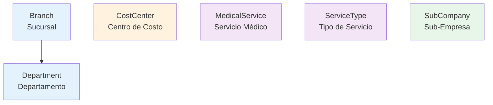

# SPEC: Mantenedores de Estructura

**Categoría**: Structure  
**Total Mantenedores**: 6  
**Estado**: ✅ Implementado  
**Última actualización**: 2026-02-09

---

## 📐 Arquitectura

Todos los mantenedores de estructura extienden `AbstractMantenedorController` que implementa:
- ✅ CRUD completo con Template Method Pattern
- ✅ Paginación automática vía QueryBuilder
- ✅ Turbo Frames para modales
- ✅ Multi-tenancy con TenantEntityManager
- ✅ Exportación CSV

**Ruta base**: `/maintainers/structure/{mantenedor}`

---

## 🗂️ Mantenedores Implementados

### 1. Branch (Sucursales)

**Controlador**: `App\Controller\Maintainers\Structure\BranchController`  
**Entidad**: `App\Entity\Tenant\Branch`  
**Form**: `App\Form\Maintainers\Organizational\BranchType`  
**Template**: `templates/maintainers/structure/branch/index.html.twig`

**Endpoints**:
- `GET /maintainers/structure/branch` → `app_maintainers_branch_index` - Listado con paginación
- `GET /maintainers/structure/branch/create` → `app_maintainers_branch_create` - Crear (modal)
- `GET /maintainers/structure/branch/{id}/edit` → `app_maintainers_branch_edit` - Editar (modal)
- `POST /maintainers/structure/branch/{id}/delete` → `app_maintainers_branch_delete` - Eliminar
- `GET /maintainers/structure/branch/export` → `app_maintainers_branch_export` - Exportar CSV

**Columnas**: name, code, city, region, phone, email, isActive  
**Paginación**: ✅ QueryBuilder (ORDER BY name ASC)  
**Turbo Frame**: ✅ Modal para create/edit  
**Features**: CRUD completo + Export CSV

**Descripción**: Gestión de sucursales de la organización, incluyendo información de contacto y ubicación geográfica.

---

### 2. Cost Center (Centros de Costo)

**Controlador**: `App\Controller\Maintainers\Structure\CostCenterController`  
**Entidad**: `App\Entity\Tenant\CostCenter`  
**Form**: `App\Form\Maintainers\Organizational\CostCenterType`  
**Template**: `templates/maintainers/structure/cost_center/index.html.twig`

**Endpoints**:
- `GET /maintainers/structure/cost-center` → `app_maintainers_cost_center_index` - Listado con paginación
- `GET /maintainers/structure/cost-center/create` → `app_maintainers_cost_center_create` - Crear (modal)
- `GET /maintainers/structure/cost-center/{id}/edit` → `app_maintainers_cost_center_edit` - Editar (modal)
- `POST /maintainers/structure/cost-center/{id}/delete` → `app_maintainers_cost_center_delete` - Eliminar
- `GET /maintainers/structure/cost-center/export` → `app_maintainers_cost_center_export` - Exportar CSV

**Columnas**: name, code, description, isActive  
**Paginación**: ✅ QueryBuilder (ORDER BY name ASC)  
**Turbo Frame**: ✅ Modal para create/edit  
**Features**: CRUD completo + Export CSV

**Descripción**: Gestión de centros de costo para asignación presupuestaria y control financiero.

---

### 3. Department (Departamentos)

**Controlador**: `App\Controller\Maintainers\Structure\DepartmentController`  
**Entidad**: `App\Entity\Tenant\Department`  
**Form**: `App\Form\Maintainers\Organizational\DepartmentType`  
**Template**: `templates/maintainers/structure/department/index.html.twig`

**Endpoints**:
- `GET /maintainers/structure/department` → `app_maintainers_department_index` - Listado con paginación
- `GET /maintainers/structure/department/create` → `app_maintainers_department_create` - Crear (modal)
- `GET /maintainers/structure/department/{id}/edit` → `app_maintainers_department_edit` - Editar (modal)
- `POST /maintainers/structure/department/{id}/delete` → `app_maintainers_department_delete` - Eliminar
- `GET /maintainers/structure/department/export` → `app_maintainers_department_export` - Exportar CSV

**Columnas**: name, code, branch, description, isActive  
**Paginación**: ✅ QueryBuilder (ORDER BY name ASC)  
**Turbo Frame**: ✅ Modal para create/edit  
**Features**: CRUD completo + Export CSV

**Descripción**: Gestión de departamentos organizacionales. Incluye relación con sucursales (Branch).

**Relaciones**:
- `branch` → ManyToOne con `Branch` (con leftJoin en QueryBuilder)

---

### 4. Medical Service (Servicios Médicos)

**Controlador**: `App\Controller\Maintainers\Structure\MedicalServiceController`  
**Entidad**: `App\Entity\Tenant\MedicalService`  
**Form**: `App\Form\Maintainers\Clinical\MedicalServiceType`  
**Template**: `templates/maintainers/structure/medical_service/index.html.twig`

**Endpoints**:
- `GET /maintainers/structure/medical-service` → `app_maintainers_medical_service_index` - Listado con paginación
- `GET /maintainers/structure/medical-service/create` → `app_maintainers_medical_service_create` - Crear (modal)
- `GET /maintainers/structure/medical-service/{id}/edit` → `app_maintainers_medical_service_edit` - Editar (modal)
- `POST /maintainers/structure/medical-service/{id}/delete` → `app_maintainers_medical_service_delete` - Eliminar
- `GET /maintainers/structure/medical-service/export` → `app_maintainers_medical_service_export` - Exportar CSV

**Columnas**: name, code, isActive  
**Paginación**: ✅ QueryBuilder (ORDER BY name ASC)  
**Turbo Frame**: ✅ Modal para create/edit  
**Features**: CRUD completo + Export CSV

**Descripción**: Catálogo de servicios médicos disponibles en la institución.

---

### 5. Service Type (Tipos de Servicio)

**Controlador**: `App\Controller\Maintainers\Structure\ServiceTypeController`  
**Entidad**: `App\Entity\Tenant\ServiceType`  
**Form**: `App\Form\Maintainers\Clinical\ServiceTypeType`  
**Template**: `templates/maintainers/structure/service_type/index.html.twig`

**Endpoints**:
- `GET /maintainers/structure/service-type` → `app_maintainers_service_type_index` - Listado con paginación
- `GET /maintainers/structure/service-type/create` → `app_maintainers_service_type_create` - Crear (modal)
- `GET /maintainers/structure/service-type/{id}/edit` → `app_maintainers_service_type_edit` - Editar (modal)
- `POST /maintainers/structure/service-type/{id}/delete` → `app_maintainers_service_type_delete` - Eliminar
- `GET /maintainers/structure/service-type/export` → `app_maintainers_service_type_export` - Exportar CSV

**Columnas**: name, code, description, isActive  
**Paginación**: ✅ QueryBuilder (ORDER BY name ASC)  
**Turbo Frame**: ✅ Modal para create/edit  
**Features**: CRUD completo + Export CSV

**Descripción**: Clasificación de tipos de servicios para categorización de servicios médicos.

---

### 6. Sub Company (Sub-Empresas)

**Controlador**: `App\Controller\Maintainers\Structure\SubCompanyController`  
**Entidad**: `App\Entity\Tenant\SubCompany`  
**Form**: `App\Form\Maintainers\Organizational\SubCompanyType`  
**Template**: `templates/maintainers/structure/sub_company/index.html.twig`

**Endpoints**:
- `GET /maintainers/structure/sub-company` → `app_maintainers_sub_company_index` - Listado con paginación
- `GET /maintainers/structure/sub-company/create` → `app_maintainers_sub_company_create` - Crear (modal)
- `GET /maintainers/structure/sub-company/{id}/edit` → `app_maintainers_sub_company_edit` - Editar (modal)
- `POST /maintainers/structure/sub-company/{id}/delete` → `app_maintainers_sub_company_delete` - Eliminar
- `GET /maintainers/structure/sub-company/export` → `app_maintainers_sub_company_export` - Exportar CSV

**Columnas**: name, code, taxId, description, isActive  
**Paginación**: ✅ QueryBuilder (ORDER BY name ASC)  
**Turbo Frame**: ✅ Modal para create/edit  
**Features**: CRUD completo + Export CSV

**Descripción**: Gestión de sub-empresas o divisiones de la organización, incluyendo información fiscal (RUT/TaxId).

---

## 🔧 Componentes Compartidos

### Templates Base
- `templates/maintainers/modern_index.html.twig` - Template maestro
- `templates/maintainers/_base_index.html.twig` - Base alternativa
- `templates/maintainers/_modal_form.html.twig` - Modal para forms

### AbstractMantenedorController
**Ubicación**: `src/Controller/AbstractMantenedorController.php`

**Métodos requeridos** (Template Method):
```php
protected function getData(Request $request): array|QueryBuilder;
protected function getColumns(): array;
protected function getTemplatePath(): string;
protected function getFormType(): string;
protected function createNewEntity(): object;
protected function getIndexRoute(): string;
protected function findEntity(int $id): ?object;
```

**Métodos implementados**:
- `handleIndex()` - Listado con paginación automática
- `handleCreate()` - Crear con Turbo Frame
- `handleEdit()` - Editar con Turbo Frame
- `handleDelete()` - Eliminar con confirmación
- `handleExport()` - Exportar CSV
- `paginate()` - Paginación con Doctrine Paginator
- `isTurboFrameRequest()` - Detección Turbo Frame

### Paginación Automática
**Detección por tipo de retorno**:
- `QueryBuilder` → Paginación activada ✅
- `Array` → Sin paginación ❌

**Parámetros URL**: `?page=1&limit=10`  
**Default**: 10 items por página

---

## 🎨 UI/UX

**Framework**: Bootstrap 5.3.0  
**Iconos**: BoxIcons (`bx-*`)  
**Modales**: Turbo Frames  
**Confirmación delete**: SweetAlert2  
**Responsive**: ✅ Mobile-first

**Breadcrumb típico**:
```
Dashboard > Mantenedores > Estructura > {Mantenedor}
```

---

## 🔐 Seguridad

- ✅ CSRF Protection en formularios
- ✅ Multi-tenancy aislamiento por TenantContext
- ✅ Validación Doctrine constraints
- ✅ Method-level security con `#[Route]` methods

---

## 📊 Estado de Implementación

| Característica | Estado |
|---------------|--------|
| CRUD Completo | ✅ 6/6 |
| Paginación | ✅ 6/6 |
| Exportación | ✅ 6/6 |
| Turbo Frames | ✅ 6/6 |
| Forms validados | ✅ 6/6 documentados |
| Tests unitarios | ❌ No implementado |
| Permisos/Roles | ❌ No implementado |

---

## 🏗️ Estructura de Directorios

```
src/Controller/Maintainers/Structure/
├── BranchController.php
├── CostCenterController.php
├── DepartmentController.php
├── MedicalServiceController.php
├── ServiceTypeController.php
└── SubCompanyController.php

src/Entity/Tenant/
├── Branch.php
├── CostCenter.php
├── Department.php
├── MedicalService.php
├── ServiceType.php
└── SubCompany.php

src/Form/Maintainers/
├── Organizational/
│   ├── BranchType.php
│   ├── CostCenterType.php
│   ├── DepartmentType.php
│   └── SubCompanyType.php
└── Clinical/
    ├── MedicalServiceType.php
    └── ServiceTypeType.php

templates/maintainers/structure/
├── branch/
│   └── index.html.twig
├── cost_center/
│   └── index.html.twig
├── department/
│   └── index.html.twig
├── medical_service/
│   └── index.html.twig
├── service_type/
│   └── index.html.twig
└── sub_company/
    └── index.html.twig
```

---

## 📝 Notas Técnicas

1. **Multi-tenancy**: Todos los mantenedores usan `TenantEntityManager` para aislar datos por tenant
2. **Soft Delete**: No implementado - Delete es físico
3. **Audit Trail**: No implementado
4. **Ordenamiento**: Por defecto `ORDER BY name ASC` (excepto donde se especifique otro)
5. **Búsqueda/Filtros**: No implementado en base
6. **Import masivo**: No implementado
7. **Relaciones**: Department tiene relación con Branch usando leftJoin

---

## 🔗 Relaciones entre Mantenedores



**Leyenda**:
- 🔵 Azul: Estructura organizacional jerárquica
- 🟠 Naranja: Estructura financiera
- 🟣 Morado: Estructura clínica
- 🟢 Verde: Estructura corporativa

---

## 🚀 Próximos Pasos

1. Implementar tests unitarios
2. Agregar sistema de permisos por rol
3. Implementar búsqueda/filtros en listados
4. Agregar soft delete
5. Implementar import CSV masivo
6. Implementar relaciones adicionales (ServiceType → MedicalService)
7. Agregar validaciones de negocio complejas
8. Implementar audit trail automático

---

## 📋 Checklist de Validación

- [x] Todos los controladores extienden AbstractMantenedorController
- [x] Todos los endpoints usan nombres de ruta consistentes
- [x] Todos los mantenedores tienen exportación CSV
- [x] Todos los templates siguen la estructura estándar
- [x] Todos los forms están implementados
- [x] Paginación implementada en todos los listados
- [x] Turbo Frames implementados en create/edit
- [x] Multi-tenancy configurado correctamente
- [ ] Tests unitarios
- [ ] Tests de integración
- [ ] Validación de permisos
- [ ] Documentación de API
